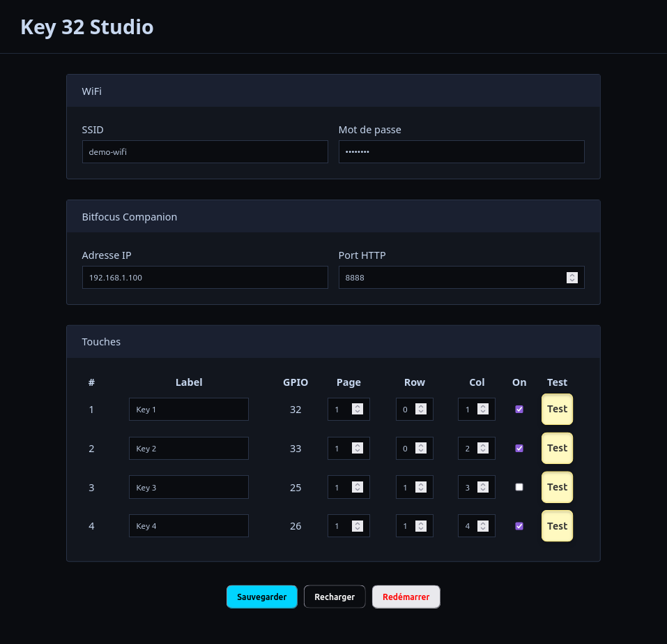

# Key 32 Studio

Un panneau de type **Stream Deck Studio** pour [Bitfocus Companion](https://bitfocus.io/companion) basé sur un **ESP32**.  
Il permet de contrôler Companion via l’API REST avec des **boutons physiques** comme des **Cherry MX** ou **NKK**.

## Fonctionnalités actuelles

- Configuration des paramètres Wi-Fi et de l’adresse IP/port pour communiquer avec Companion
- Configuration individuelle des boutons :
  - Mappage sur les boutons de Companion
  - Activation/désactivation
  - Test de l’action associée
- Gestion des boutons cablés sur des GPIO individuels
- Interface Web pour paramétrer facilement le panneau

## Matériel

- **ESP32**
- Boutons physiques :
  - Cherry MX (switch mécanique)
  - NKK (switch type "broadcast" comme la série UB2)

## Dépendances

 - Installer [Arduino IDE](https://www.arduino.cc/en/software)
 - Environnement **ESP32** pour Arduino IDE
 - Librairie **ArduinoJson**
 - Réseau WiFi

## Roadmap

- [x] Version initiale fonctionnelle
- [ ] Ajouter LEDs d’état configurables dans l’interface Web
- [ ] Ajouter gestion des boutons en matrice
- [ ] Ajouter écran OLED pour affichage IP et infos Companion
- [ ] Afficher label sur l'écran (via une touche info par exemple)
- [ ] Ajouter profils de boutons sauvegardables
- [ ] Connexion Ethernet
- [ ] Alimentation via PoE

## Licence

À définir
